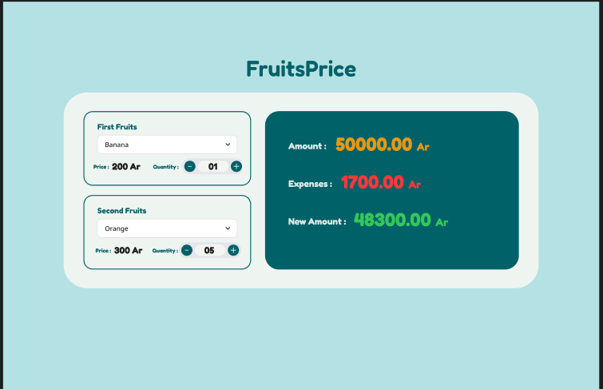

# 🍎 FruitsPrice

FruitsPrice is a beginner-friendly React.js project that simulates a fruit shopping calculator.

## Features

- 🍌 Select fruits from a dropdown list.
- ➕ Increase or decrease the quantity.
- 💰 Display the price of the selected fruit.
- 📊 Calculate total expenses.
- 💵 Display the remaining balance.

## Technologies

- React.js
- JavaScript (ES6+)
- CSS3
- HTML5

## Fruits-Price-Design

